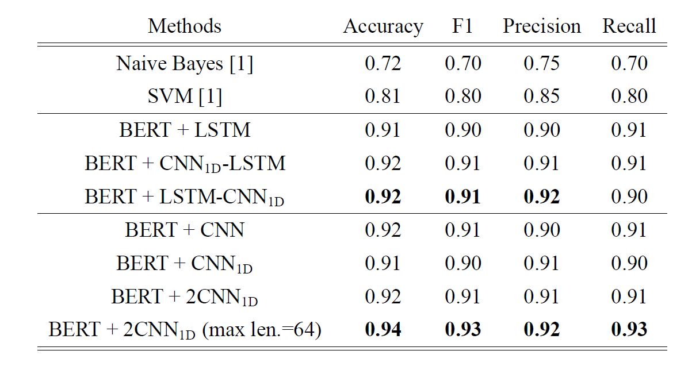

# Toxic Comment Detection Using Transfer Learning Based on BERT

## Abstract

With the spread of social media among people, one of the main concerns today is to keep this platform peaceful and safe for exchanging information and sharing opinions. One of the factors disrupting the peace of social media is posting and reading insulting, racist, and threatening comments. We call such comments toxic. Our need is to identify these toxic comments and prevent them from being shared. Since classic AI models are not accurate in this problem, it is necessary to use machine learning to address this natural language processing task. In this paper, we fine-tuned models based on BERT to detect toxic comments. The models that were built conceptually can be divided into two categories:

1. Sequence Learning from BERT Representations of input words
2. Feature Extraction from BERT Representations of input words

Sequence Learning is performed based on recurrent neural networks and feature extraction is done by a one-dimensional convolutional neural network (CNN). In sequence learning models we decided to enhance the output of BERT by LSTM network and to be more accurate, we added a CNN layer to them, But in Feature Extraction models, we used just CNN to extract which phrases are relevant or not from BERT representation of the corresponding sentence. We proposed two models based on Sequence Learning and two models based on Feature Extraction. The list of models is below:

1. Sequence Learning
   - BERT+LSTM-CNN
   - BERT+CNN-LSTM
2. Feature Extraction
   - BERT+CNN-1D
   - BERT+2CNN-1D

The best model is BERT+2CNN-1D with Accuracy and F1-score of 0.94 and 0.93 respectively. All models will be explained further.

## Related Work

In the work of [1], CNN was used to detect toxic comments. Their word embedding was word2vec (skip-gram). Another model was proposed in the work of [2] which is based on LSTM and word representation SpaCy. Accuracy of the model is 0.95, but they did not publish the dataset they used. Besides, we cannot be sure about the generalization of the model, because the size of their dataset was not large and they did not use transfer learning from pre-trained models. In [3], LSTM and CNN were used to detect toxic phrases. Their word representation was the output of the last hidden layer of BERT (without fine-tuning). Accuracy of both models was around 0.91 and their dataset was collected from Twitter corpus.
Another model was proposed in [4] which adds an LSTM layer to BERT called BERT+LSTM. Furthermore, in the aforementioned paper, a model called  BERT+CNN was introduced that uses all layers of BERT and creates a 3D tensor which is the input of a CNN. The performance of BERT+CNN was better than BERT+LSTM. However, it has high memory complexity. I propose two alternatives to BERT+LSTM and two alternatives to BERT+CNN to reduce memory complexity and keep its Accuracy the same.
BERT+LSTM | BERT+CNN
:-------------------------:|:-------------------------:
 | 

## Methodology

In this project, I propose four strategies to fine-tune the BERT model to detect toxic comments in social media. I did not use the corresponding output of the [CLS] token and just used representations of the given words i.e. the output of the last hidden layer of BERT. In all models, convolution layers are one-dimensional and the output dimension of LSTM layers is the same as the input. The number of kernels in CNNs is 64 whereever was not mentioned. I set the maximum length of sentences to 36 in the tokenization phase.

### Model 1: BERT+LSTM-CNN

Detecting some toxic comments needs sequence learning and some of them just need feature extraction. In this model, I give the last hidden layer of BERT to an LSTM and then a 1D-CNN layer.  I propose this and BERT+CNN-LSTM models to find both. the result of this model is better than BERT+CNN-LSTM.

 

 
### Model 2: BERT+CNN-LSTM ###
The motivation of this model is the same as model 1, but instead of that, sequence learning by LSTM starts after feature extraction. 

 

 
### Model 3: BERT+CNN-1D ###
This model gives the last hidden layer of BERT to CNN for feature extraction. we know to detect almost toxic comments, we just need feature extraction, but BERT representation of words in lexicon-semantic vector space can separate toxic words(phrases) from normal words and these embeddings can help CNN to extract the features. 

 

 
### Model 4: BERT+2CNN-1D ###
 In this architecture, the pooling layer of the first CNN layer works with a kernel and does not perform maximum pooling on the whole of the input sequence. works with kernel size. With the help of this technique after one CNN layer, we have a matrix and can apply a CNN on it again. 

 

## Dataset
To assess the models, I chose a multi-labeled dataset gathered by the [Conversation AI](https://conversationai.github.io/) team. The corpus has 159,571 comments with an average length of 67. The labels are toxic, severe_toxic, obscene, threat, insult, and identity_hate. The OR operation is used to change the task to binary classification. By doing this, the ratio of the number of positive examples to negative examples is 0.9. So, I sample twice as many toxic comments from the set of negative non-toxic comments. 
## Results

BERT+CNN model used 6 GB memory to evaluate 4,600 sentences, But BERT+2CNN-1D just needs 2 GB. Because of the good memory complexity of this model, I trained the model with a maximum length of 64 to be more accurate (the average length of sentences in the dataset is 67). In this case, its memory usage was 3 GB.

## References

[1] Georgakopoulos, Spiros V., et al. ”Convolutional neural networks for toxic comment
classification.” Proceedings of the 10th hellenic conference on artificial intelligence. 2018.

[2] Dubey, Krishna, et al. ”Toxic Comment Detection using LSTM.” 2020 Third International
Conference on Advances in Electronics, Computers and Communications
(ICAECC). IEEE, 2020.

[3] d’Sa, Ashwin Geet, Irina Illina, and Dominique Fohr. ”Bert and fasttext embeddings
for automatic detection of toxic speech.” 2020 International Multi-
Conference on:“Organization of Knowledge and Advanced Technologies”(OCTA).
IEEE, 2020.

[4] Mozafari, Marzieh, Reza Farahbakhsh, and Noel Crespi. "A BERT-based transfer learning approach for hate speech detection in online social media." International Conference on Complex Networks and Their Applications. Springer, Cham, 2019.
